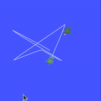
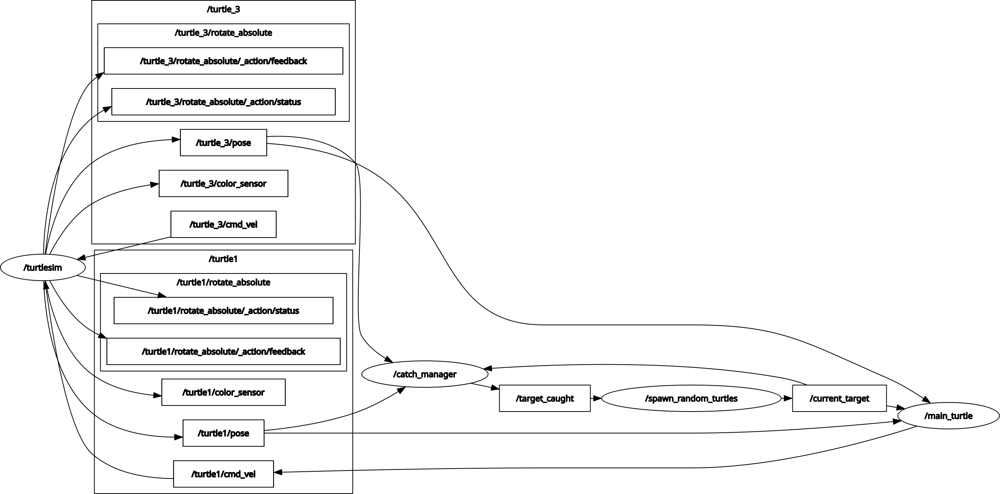

# ROS 2 Turtlesim Catcher (Spawn, Chase, Kill, Repeat)

A fun ROS 2 mini-project built on `turtlesim` where `turtle1` automatically chases randomly spawned turtles, “catches” them, kills them using the `/kill` service, then spawns the next target and repeats.

This project is implemented as **three ROS 2 nodes** (Python, `rclpy`) plus the standard `turtlesim_node`.
## Demo



---

## What it does

1. Spawns a target turtle at a random pose  
2. Publishes the active target name  
3. Makes `turtle1` rotate toward the target and move toward it  
4. Detects when the target is within a catch distance  
5. Calls `/kill` to remove the target  
6. Publishes a “target caught” message so the next turtle gets spawned

---

## Nodes in this package

### 1) `spawn_random_turtles`
**File:** `final_project/spawn_random_turtles.py`  
**Role:** Spawns a new turtle and announces it as the current target.

- Calls service: `/spawn` (`turtlesim/srv/Spawn`)
- Publishes: `/current_target` (`std_msgs/String`)
- Subscribes: `/target_caught` (`std_msgs/String`)

**Parameter**
- `name_counter` (int, default `1`)  
  Used to name turtles like `turtle_1`, `turtle_2`, ...

---

### 2) `main_turtle`
**File:** `final_project/main_turtle.py`  
**Role:** Controls `turtle1` to chase the currently active target.

- Subscribes: `/turtle1/pose` (`turtlesim/msg/Pose`)
- Subscribes: `/current_target` (`std_msgs/String`)
- Dynamically subscribes: `/<target_name>/pose` (`turtlesim/msg/Pose`)
- Publishes: `/turtle1/cmd_vel` (`geometry_msgs/msg/Twist`)

**Controller behaviour**
- If target not available, stop.
- Turn in place until heading error is small enough.
- Move forward and steer once aligned.
- Slow down near the target.
- Stop when within the catch threshold.

---

### 3) `catch_manager`
**File:** `final_project/catch_manager.py`  
**Role:** Detects when `turtle1` has caught the target, kills it, and triggers the next spawn.

- Subscribes: `/turtle1/pose` (`turtlesim/msg/Pose`)
- Subscribes: `/current_target` (`std_msgs/String`)
- Dynamically subscribes: `/<target_name>/pose` (`turtlesim/msg/Pose`)
- Calls service: `/kill` (`turtlesim/srv/Kill`)
- Publishes: `/target_caught` (`std_msgs/String`)

---

## ROS Flow
## ROS Graph




`turtlesim_node` provides:
- `/spawn` service
- `/kill` service
- `/turtle1/pose`, `/<turtle_name>/pose` topics
- `/turtle1/cmd_vel` input

Your package provides:
- `/current_target` topic (who to chase)
- `/target_caught` topic (spawn the next one)

---

## Requirements

- ROS 2 (Python-based install)
- `turtlesim`
- `rclpy`

Tested as a standard `ament_python` package.

---

## Build and run

### 1) Create a workspace (if you do not have one)
```bash
mkdir -p ~/ros2_ws/src
cd ~/ros2_ws/src
